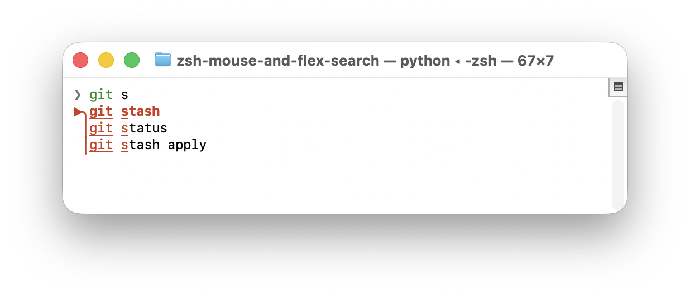

# zsh mouse and flex history search



A modernized terminal UI for searching zsh history with Emacs-style `flex` fuzzy matching, full mouse support for setting point and related interactions, and syntax highlighting; in `.zshrc`, wire it via a `zle-line-init` hook (see zshrc file for how to exit the program and execute the command). It works in other shells too when invoked directly.


## Homebrew Install and Setup

```bash
brew tap uAlexk/tools
brew install --HEAD zsh-flex-history
echo 'source "$(brew --prefix)/share/zsh-flex-history/zsh-flex-history.zsh"' >> "${ZDOTDIR:-$HOME}/.zshrc"
```

Optionally, to import your existing Zsh history into the custom SQLite history database, run:

`zsh-flex-history-import`

## Manual Setup

```bash
./zsh_flex_history.py --use-custom-history --print-only
```

See zshrc file for how to modify your zshrc to auto run.

## Behavior

- Uses in-order flexible fuzzy matching (similar to Emacs `flex`).
- Shows a completing-read style vertical completion menu with highlighted match chars.
- Prioritizes first-token matches (command completion and matching command prefixes) ahead of deeper in-string matches, then scores by recency and query fit.
- For directory-aware prioritization, use `--use-custom-history` so history scoring can include current `cwd`, which improves relevance for repeated workflows per folder.
- Takes over mouse `x` from the native terminal app only when there is any text in the prompt.
- Syntax highlighting is "good enough" but incomplete

## Options


- `--use-custom-history`
  - Uses an alternate per-user SQLite history backend.
  - Stores commands as UTF-8 text by default, unlike zsh
  - Includes extra metadata per entry (`command`, `cwd`, `timestamp`).
- `--history-length <N>`
  - Maximum number of SQLite history rows to load on the daemon's initial startup from the custom history DB (default: `10k`).
  - Accepts values like `10000` or `10k`.
  - Applies only to `--use-custom-history` and only on the daemon's first load; normal `~/.zsh_history` is not trimmed.
  - Does not delete rows from the SQLite file. Later daemon refreshes load normally without this cap.
- `--print-only`
  - Prints the selected command to stdout instead of executing it.


## Keys

- `Up` / `Down` / Scroll: move selection
- `Tab`: inserts selected command
- `PageUp` / `PageDown`: move faster
- `Backspace`: delete query char
- `Enter`: print and optionally runs the selected command
- `Cmd-C` / `Cmd-V`: copy/paste query text in kitty while mouse takeover is active
- `Esc` or `Ctrl-C`: quit
